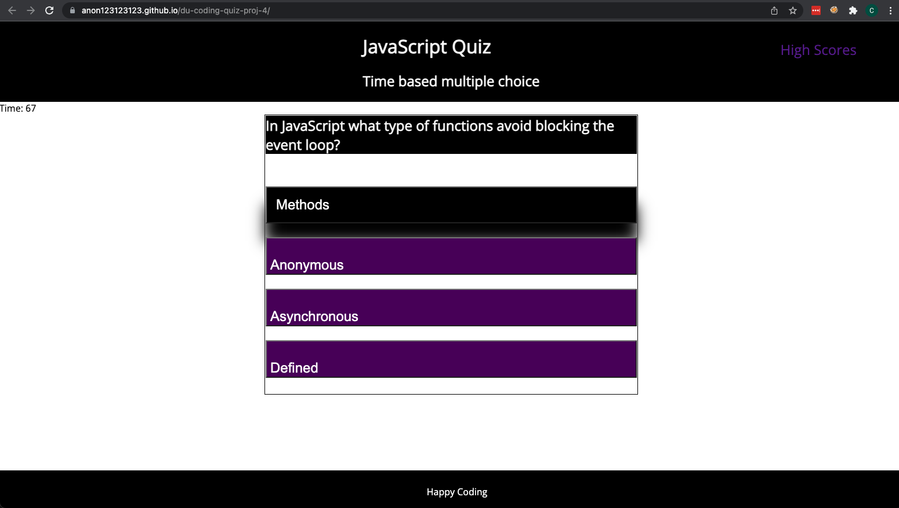

# Du-coding-quiz-proj-4
DU coding homework - Create small interactive JS quiz

## Objectives 

The objective of this coding project was to create a small coding quiz. That uses ```localstorage``` as a form of tracking scores.

- The app should track scores
- Time based quiz that reduces time upon incorrect answer 
- Scores are based on time and allows initials to be entered with score

Application is hosted on Github pages:

[Hosted Quiz](https://anon123123123.github.io/du-coding-quiz-proj-4/index.html)

## Design features 

- The application is done with semantic HTML. 
- The JavaScript is asynchronous to avoid event blocking. 
- CSS is done with REM sizing and small adjustments with media queries to allow smaller screens.


